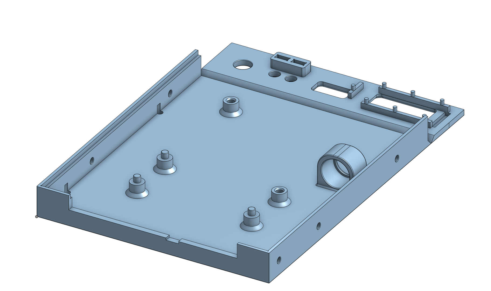
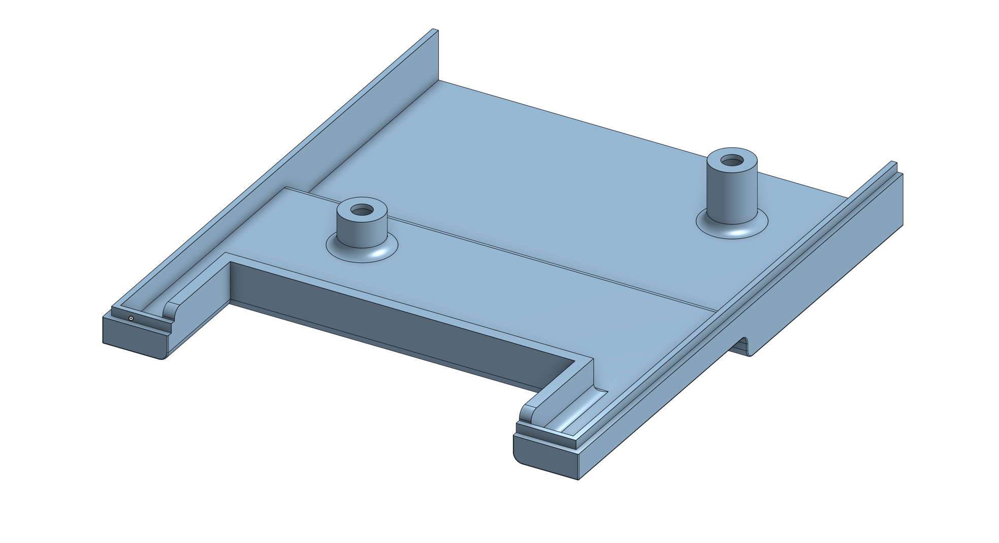
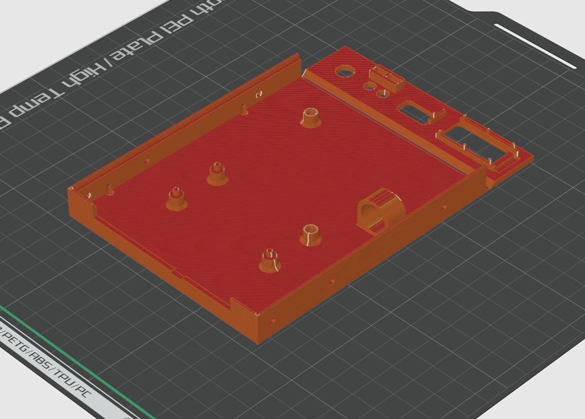
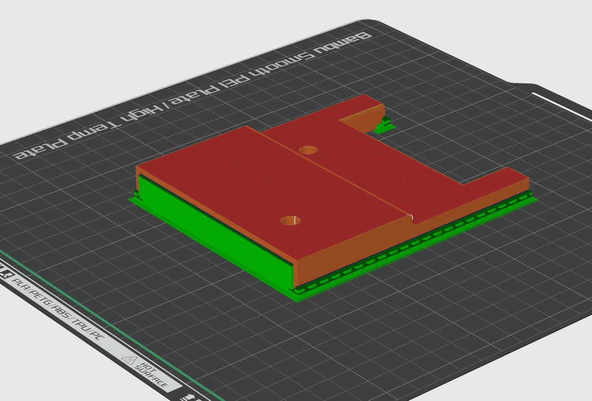
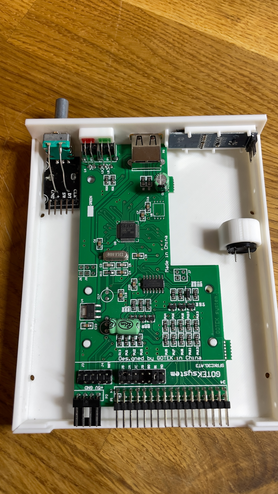
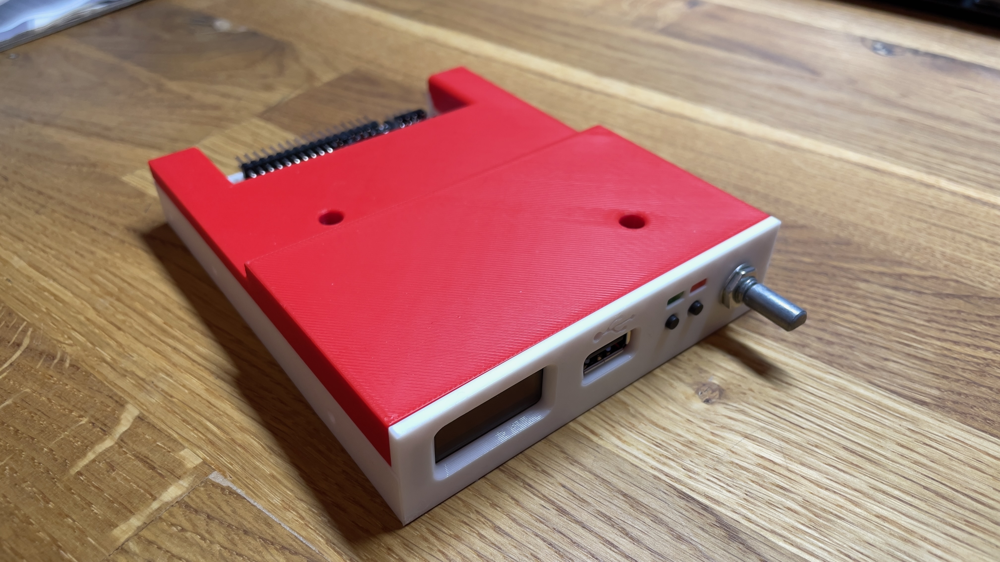
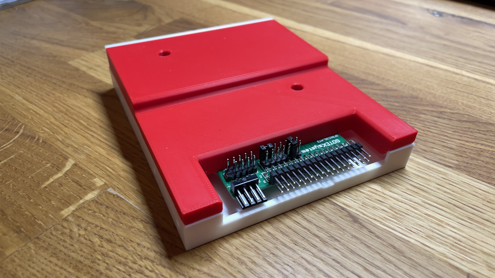
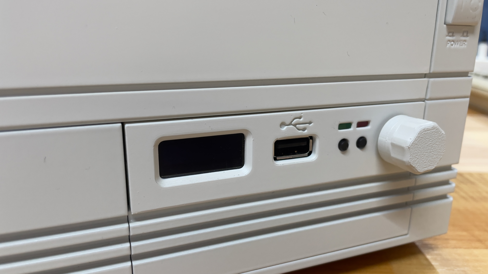
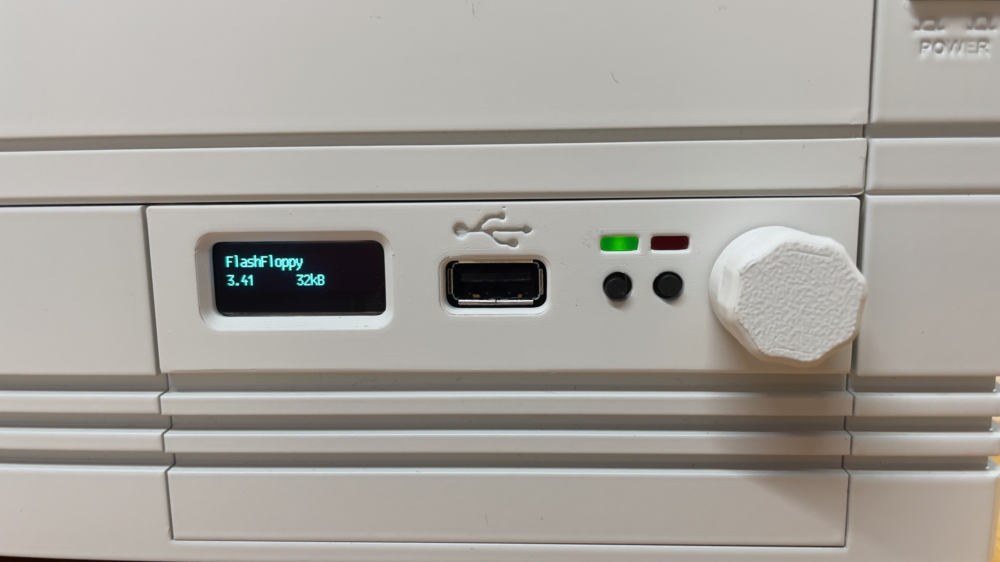

[clockchip GitHub Repositories](https://github.com/clockchip?tab=repositories)

# 3D-Printable Alternative Gotek Drive Case

This is a 3D-printable alternative case for a Gotek drive, primarily designed for my Amiga 4000. It can also be installed in other computers as it supports the standardized 3.5” drive bay size.

The case consists of a bottom part, top part, and a rotary knob. It supports all the features of the original case and offers these additional advantages:

- Support for installation of a KY-040 rotary encoder
- Alternative rotary knob for the encoder
- Easy mounting of a 0.91” OLED display
- Rectangular LED indicators for power and floppy activity
- Easy installation of a buzzer to emulate floppy drive sounds

## Printing Notes

To ensure clean printing of the front panel, it has been oriented 90 degrees down on the print bed. Depending on your print bed surface, you can achieve textures ranging from smooth to textured.

For my setup with a Bambu Lab P1S, I use the following print plates:

- Smooth finish: Smooth PEI Plate / High Temp Plate
- Textured finish: Textured PEI Plate

The bottom part and rotary knob can be printed without support structures. They should be oriented so that their outer surfaces lie flat on the print bed.

    

The top section should be printed with basic supports and oriented with its outer surface facing upward.

    

Ensure that filament flow is calibrated to avoid unwanted gaps on the surface.

## Assembly Instructions

The assembly is mostly straightforward:

    

- Bend the front panel 90 degrees upward from the bottom and glue it in place.
- When the glue is dry, the front panel can optionally be painted—for example, in RAL 9002 to match the Amiga 4000.
- Detailed instructions for the hardware modifications supported by this case can be found on the [FlashFloppy](https://github.com/keirf/flashfloppy/wiki/Hardware-Mods) website.
- The mechanical modifications required to install the rotary encoder are the same as those for the original case. However, when using the alternative rotary knob, the metal shaft of the encoder must be shortened by 5mm using a metal saw.
- Replace the original LEDs with rectangular [2x5x7 mm LEDs](https://www.amazon.de/gp/product/B01C3ZZT0U/ref=ppx_yo_dt_b_search_asin_title?ie=UTF8&psc=1). If they are too bright, a suitable resistor can be added.
- The OLED display is inserted into its socket and fixed in place by melting the seven pins with a soldering iron.
- The buzzer is inserted into its slot and should be held securely by a press fit. If it is loose, plastic glue can be used.

## Pictures

Here are some pictures of my Amiga 4000 with the modified case.

    

    

    

    

## License

<a property="dct:title"  rel="cc:attributionURL"  href="https://github.com/clockchip/Alternative-Gotek-Drive-Case">Alternative Gotek Drive Case</a> by clockchip is licensed  under <a  href="http://creativecommons.org/licenses/by-nc-sa/4.0/?ref=chooser-v1"  target="_blank" rel="license noopener noreferrer"  style="display:inline-block;">CC BY-NC-SA 4.0</a>
  
